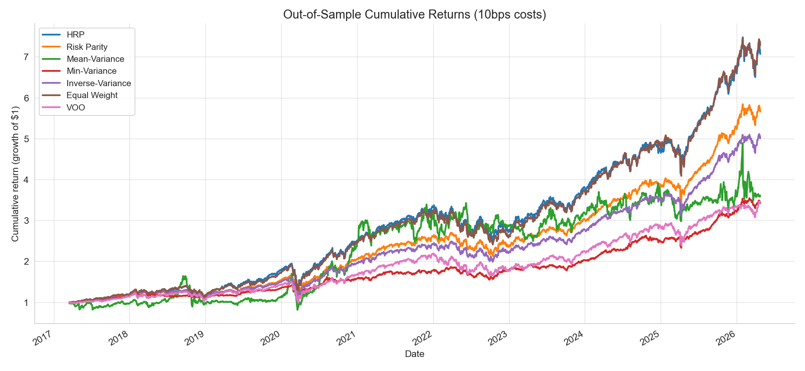
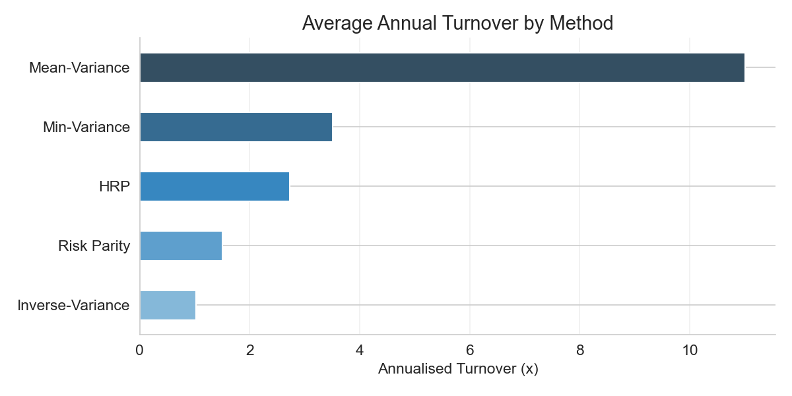
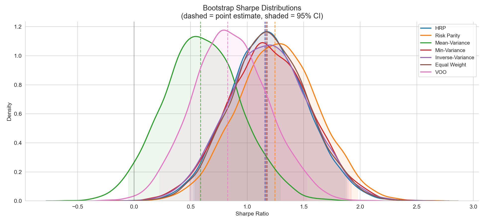
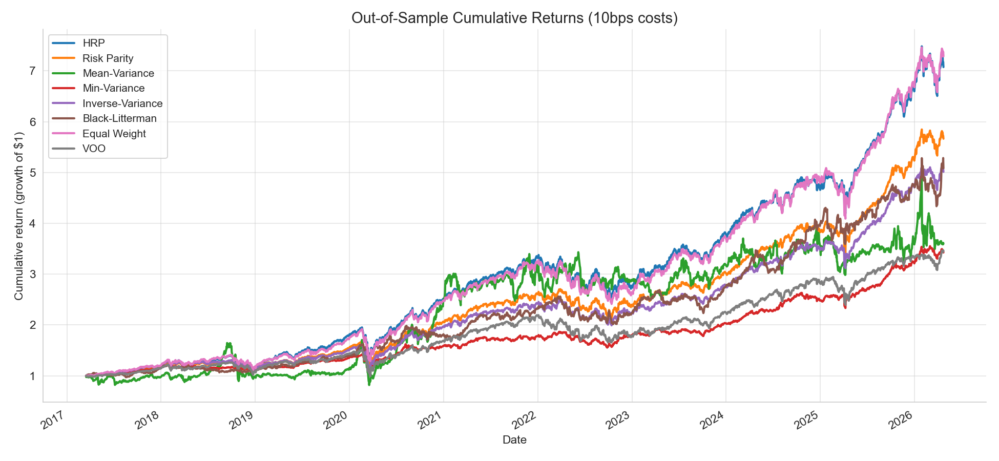
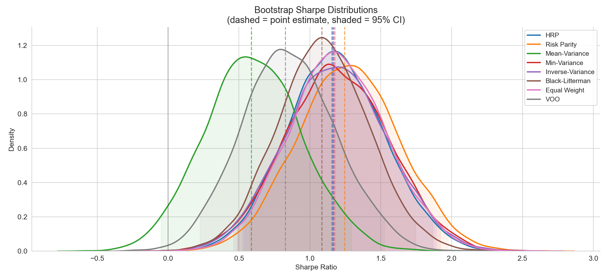

# Portfolio Construction Study

Seven portfolio construction methods were compared on a 22-asset universe ---including equities, commodities (GLD, SLVR) and etfs--- over the last 10 years, with transaction costs and turnover penalties. 

We compared HRP, Risk Parity, Mean-Variance, Min-Variance, and Inverse-Variance against the benchmarks of an Equal Weight portfolio and the full S&P 500 (VOO).

The stock universe is:
Personal: 'VOO', 'AAPL', 'SMH', 'TSM', 'MSFT', 'AMD', 'BOTZ', 'NLR'
Big Tech: 'AMZN', 'GOOG', 'TSLA', 'JPM', 'META', 'ASML', 'V'
Defense: 'LMT', 'RTX', 'GD', 'NOC'
Commodities: 'GLD', 'SLV', 'XLE'
International equity (not currently included): 'EWJ', 'EWZ', 'INDA'
Note we do not include NVDA because of its increase in 20s, this causes Mean-Variance to over-perform and adds massive amounts of survivorship bias.

---

## Out-of-Sample Backtest

Across six allocation methods on a 22-asset US equity universe (2015–2026, 10bps transaction costs), risk-parity-style methods (Risk Parity, HRP, Equal Weight) achieved the highest Sharpe ratios (1.1–1.25), while mean-variance optimization performed worst (Sharpe 0.6) due to high turnover consuming returns.

---

## Turnover & Transaction Costs

Mean-Variance incurs turnover of ~10.1x per rebalance — an order of magnitude above every other method — which directly explains its poor risk-adjusted performance despite reasonable gross returns. Inverse-Variance and Risk Parity are the most turnover-efficient optimised methods, approaching the zero-turnover baseline of Equal Weight.

---

## Statistical Significance

With 10 years of data, Risk Parity, HRP, Equal Weight, and Inverse-Variance all achieved Sharpe ratios statistically distinguishable from VOO at 95% confidence (block bootstrap, B=10,000), with % wins vs benchmark exceeding 99% for the top three methods.

After multiple-testing correction (Deflated Sharpe Ratio), Risk Parity (DSR 0.978), Equal Weight (DSR 0.978), and HRP (DSR 0.973) all exceed the conventional 0.95 significance threshold — a meaningful improvement over the 5-year results, confirming that sample length is a binding constraint for strategy evaluation. Bootstrap confidence intervals on individual Sharpe ratios still span ~1.3 units, underscoring residual uncertainty in point estimates.

---

## Key Finding

Depending on the choice of assets, we find that HRP either matches the returns of Equal Weight --or is slightly outperformed by it--  on this small, highly-correlated universe, contrary to López de Prado (2016). We hypothesize that HRP's clustering advantages require larger and more diverse universes to manifest.

For personal equity portfolio, HRP attains returns (0.24) between those of equal weight (0.244) and risk parity (0.21) methods, with risk parity having much lower volatility (0.16) than hrp (0.20) and equal weight (0.20). 
The three allocation methods attain similar Sharpe ratios of 1.16-1.24 (all with statistically significant DSR and difference to SNP).
Potentially indicates that risk-parity is advantageous for risk averse personal investors with no desire of monthly rebalancing.

---

> See `notebooks/method_comparison.ipynb` for full results and methodology.

---

## Black-Litterman Extension

A Black-Litterman (BL) allocator was added to the comparison, following Meucci (2010) with the proportional Ω heuristic from Idzorek (2005). The prior is an equal-weight equilibrium (π = 2λΣw_eq) with τ = 1/120 ≈ 0.008 (tight prior). At each monthly rebalance, four sets of K=6 relative views are generated from the trailing 120-day window and stacked into a single 24-view system:

- **Momentum:** top-K vs bottom-K by risk-adjusted momentum
- **Mean-reversion:** bottom-K vs top-K (opposite of momentum)
- **Low-volatility anomaly:** K-lowest-vol vs K-highest-vol assets (Baker et al., 2011)
- **Value (Sharpe-based):** k lowest trailing Sharpe vs K highest

Momentum and mean-reversion produce partially cancelling signals by design. When they disagree, the opposing views cancel through Ω-weighted averaging, pulling the posterior back toward the equal-weight prior. When low-vol and value views agree with one direction, BL tilts modestly.
These opposing views serve to self-regularise the weights.

### BL Backtest Results

With combined views, BL achieves an annual return of 0.196 at 0.18 volatility, producing a Sharpe ratio of 1.09 — in the same regime as Inverse-Variance (1.15) and Min-Variance (1.17). Further, BL achieves the shallowest max drawdown of any method at -.213, giving it the best Calmar ratio (0.92) in the comparison.

This is a substantial improvement over the earlier momentum-only BL baseline (Sharpe 0.66, max DD −0.6), demonstrating that more views (and view diversification) are key for BL performance.

BL's turnover of 12.5× annualised remains the highest of all methods, driven by the four view types updating independently at each rebalance.

### Statistical Significance of BL

BL's bootstrap Sharpe is 1.085 with a CI of (0.46 to 1.75), and its mean Sharpe difference vs VOO is 0.24 with a CI of (−0.43 to +0.87), an improvement over the purely-momentum-based-views approach, but still containing 0 --i.e. not statistically different to VOO at the 0.95 confidence level. 

Note also the win percentage of 0.769 against VOO as well as the statistically significant DSR of 0.965.

Risk Parity (DSR 0.985), Equal Weight (0.978), and HRP (0.974) remain the only methods with statistically significant outperformance of VOO.

### Interpretation

Combining opposing view types (momentum + mean-reversion) with factor-based views (low-vol + value) transforms BL from an aggressive momentum chaser into a moderate, drawdown-resilient allocator. The tight prior (τ = 0.008) ensures the posterior stays close to equal weight unless multiple signals agree, which prevents the extreme concentration seen with single-signal BL.

The main trade-off is turnover: BL trades far more than risk-parity methods for comparable Sharpe performance. For drawdown-sensitive investors willing to accept higher trading costs, BL with combined views is the strongest option in this comparison. For most investors, Risk Parity and Equal Weight remain the simpler and statistically safer choice.

Next steps: Idzorek (2005) confidence-based Ω calibration, turnover constraints in the optimizer, and factor-model views (Fama-French residuals) as an alternative to trailing-return signals.

---

> See `notebooks/method_comparison_w_BL.ipynb` for full BL results and methodology.

